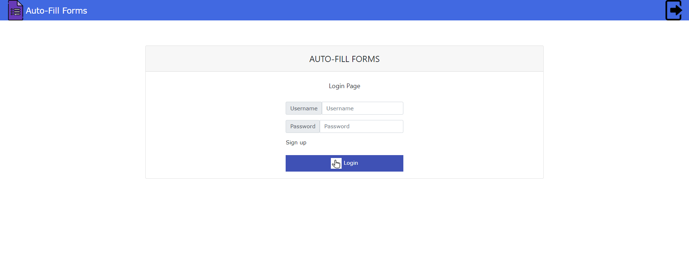
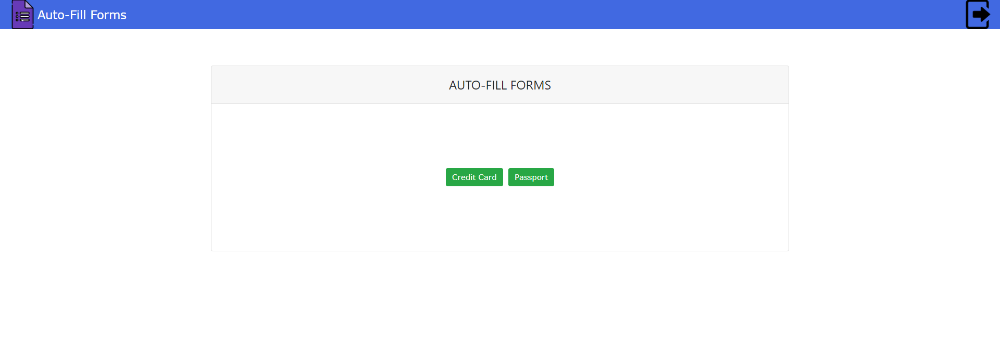
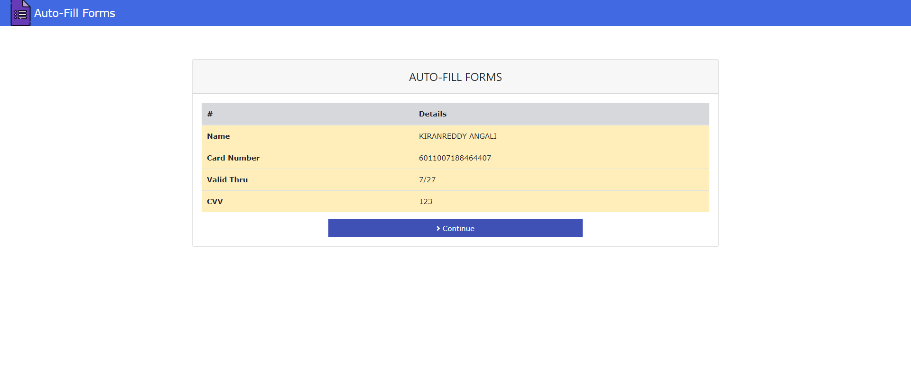

# README.md Template

# CPS 595 - P1

Source: 

University of Dayton

Department of Computer Science

CPS 595 - P1, Spring 2023

Instructor(s):

- Ahmed El Ouadrhiri
- Dr. Phu Phung 

##  Collaborating Project with Synchrony

# Auto-Fill Forms

# Team members

1.  Charith Boddu , bodduc1@udayton.edu

# Company Mentors

Arpan Bhattacharya

Synchrony

# Project Management Information

Management board (private access): https://trello.com/invite/b/xcmJlyKv/ATTIe130d895e86fa8207878de1f9ffdccb1E36CE1BC/project-autofill-forms

Source code repository (private access): https://github.com/charith-B/AutofillForm.git

# Overview

AutoFill Forms
Project Requirement: Develop an autofill capability for a web page based on a scanned document. 

Functionalities:
The application should be allowed to access the camera to capture or extract key information from an uploaded document (ex: driver license, credit cards etc.) and auto fill information on the targeted form.
Any additional or unmapped fields should be made available for the user to manually enter.

# Project Context and Scope

We see similar functionalities on Different platforms either while uploading your credit card details or while verifing your ID verification on diffferent situations. 
The functionality is mainly for user convinience where the system can automatically detect and upload data without any manual entry.

# Environment Setup

-->First step is to Install  Node.js  from the link...........===>   https://nodejs.org/en/download/

-->To verify proper installations Open terminal and type ===> npm -v

-->Next Install VSCODE using ==> https://code.visualstudio.com/Download

-->Then open VSCODE and  from the VSCODE terminal Install Angular CLI using command "npm install -g @angular/cli"

-->To verify proper installations in the terminal and type ==>ng v

![Check npm version]src/assets/img/image-ref/Angular-version.png  )

-->Now Clone the project from the git repository from the link mentioned above or by typing ==> "git clone https://github.com/charith-B/AutofillForm.git" in the VSCODE terminal

-->Once cloned open the project folder and Install Node-modules using "npm install" in the VScode terminal.
	

-->Then to run the project open new terminal in VScode and type==> "Ng serve"
	

-->This will execute the code and run the project hosting it in localhost with URL==> "http://localhost:4200/" using which we can access the project in any browser on the system.
	

# Project files Descriptions:

-->node modules:
     The node_modules file in an Angular project is a folder that contains all the dependencies and packages needed for the project to run.
     These dependencies are installed via the npm (Node Package Manager) tool, which downloads and installs the packages specified in the project's package.json file.

-->src: 
     The src file in an Angular project is a directory that contains all the source code for the project. It is the main source of the Angular application and holds the main code for the components, services, models, directives, and other essential elements of the project.
     The src file is where developers write the main logic of the application, create and modify components, and write code to make the application work as intended. It is crucial to the overall functioning and success of an Angular project.

-->angular.json:
     The angular.json file is a configuration file that is automatically generated in an Angular project when you use the Angular CLI to create a new project. It is used to store various settings and configuration options for the Angular project.

-->package.json:
     The package.json file in an Angular project is a configuration file that contains information about the project and its dependencies. It is used by npm (Node Package Manager) to manage the project's dependencies and scripts. 
     The file is located at the root of the Angular project and contains information such as the name of the project, version number, author, description, and scripts. 
     The dependencies section of the file lists all the npm packages that the project depends on, including Angular itself and any other libraries or plugins that the project requires. 
     The scripts section contains a list of npm scripts that can be run to perform various tasks, such as building the project, starting the development server, or running tests. 
     The package.json file is an important part of the Angular project and helps to ensure that the project can be easily maintained and developed over time.

-->tsconfig.json:
     The tsconfig.json file in an Angular project is a configuration file for TypeScript that provides information about how TypeScript should compile your code.
     It specifies the root directory for TypeScript files, the compiler options to use, the target version of JavaScript to generate, and the files and folders to include or exclude from the compilation. 
     This file is important for ensuring that TypeScript is compiling your code correctly and providing you with the desired outputs. It helps ensure consistency in your code by enforcing certain coding standards and practices.
     It also helps with debugging, as errors will be caught at compile-time rather than at runtime. Overall, the tsconfig.json file plays a crucial role in helping Angular projects maintain quality and maintainable code.

# Structure

Home component :
			Initial page that is loaded when the project is hosted. Only has a continue button to redirect to the forms page
	

Forms component: 
			The fields for the form are listed out here with vaidations. A button on the right of the forms with a camera icon by clicking on will redirect to a new window to Camera component. Another button for submitting the form values.
	

                     
Camera component: 
			This will redirect to a new window where the user can take a picture of the document to auto-fill the form. 
	

Review component: 
			In this page the user can review the form details for the last time before submitting the details.
	

